# 常用命令

## 工作区到暂存区

```shell
git add xxx 		把指定的文件提交到暂存区
git add .			包含修改和增加的，但是不包含删除的
git add -u			包含修改和删除的，但是不包含新增
git add -A 			同时具备 . 和 -u 特征
git status			查看文件状态
git rm --cached . -r	从暂存区撤销 .可以替换具体文件名。不管暂存区中的内容是否已经提交打历史版本上，也不管是你第几次放到暂存区上，统统撤回，太暴力

git checkout .		把暂存区的内容撤回工作区(上一个暂存区内容覆盖现有工作区中的内容，无法找回)

想要把某些问文件忽略提交，项目根目录增加 .gitignors
```

## 暂存区到历史区

```shell
git commit
git commit -m "xxx"
git commit -a -m "xxx"		把提交到暂存区 和 提交到历史区的步骤何在一起完成（兼容性不好，只适合已提交过至少一次的文件，对于新增加的文件，一次都没有提交过，是不允许这样操作的）

[root-commit]	根提交，简单理解为第一次提交到历史区域，如果我们创建一个新的仓库，但是没有做过根提交，此时我们仓库没有任何的分支（哪怕是master）,当前仓库还不完整，一个工作流程走完一遍才算完整

```

## 查看每个区代码区别

```shell
git diff		工作区VS暂存区
git diff master	工作区VS历史区MASTER分支
git diff --cached	暂存区VS历史区

工具查看：
IDE: 选中工程-》右键-》git-》compare with branch
```


# 开发中分支管理

开发过程主要存在以下分支：

- **master**

  ```
  - master主分支始终保持稳定的可发布版本
  - 只有项目组主程才拥有master主分支的管理权限（例如其他分支合并到master必须由主程操作）
  ```

- **dev** 

  ```
  - dev开发分支为不稳定版本，可能存在功能缺失，但已有的功能必须是完整的
  - 原则上不允许直接在dev分支上进行功能开发，必须新建feature分支进行开发
  ```

- **hotfix-[问题名称 | bug编号]** 

  ```
  - 从master分支创建，横线后面跟上问题名称或者对应的bug编号，仅仅适用于**生产线问题紧急修复**！！！！
  - 修复完成，测试通过，合并到master和dev分支上，然后将此分支删除
  ```

- **feature-[功能名称]** 

  ```
  - 从dev分支创建，横线后跟功能名称，用于新功能开发，每天下班前push提交到远程
  - 开发完成以后，在远程发起向dev分支的合并请求，由指定的CodeReview人员审查通过以后进行合并，并删除该分支
  ```

- **bugfix-[bug编号]** 

  ```
  - 从dev分支创建，用于修改测试提出的bug，横线后跟bug编号
  - 修复以后，在远程发起向dev分支的合并请求，并指定提交者自身（或其他人）作为CodeReview，合并以后删除该分支
  ```

- **refactor-[重构名称]**

  ```
  - 从dev分支创建，用于代码的**重大规模重构**（小规模重构创建feature分支即可）
  - 重构以后，必须经过严格测试通过，才能向dev分支合并。
  ```

#Commit 提交规范

##1、commit提交的日志格式

| 类型     | 描述                         |
| -------- | ---------------------------- |
| feat     | feature，即新开发的功能      |
| fix      | 问题修复                     |
| refactor | 重构代码                     |
| doc      | 增加文档（如readme），注释等 |

```
fix:修复身份证含字母X的用户无法注册问题
fix: 紧急修复生产线用户积分不显示的问题
feat:商品详情页功能
doc:增加项目readme文档，修改结算条款结算逻辑的注释
```

## 2、Commit提交频率

**每天下班前必须提交feature分支，并push到远程。 hotfix、feature、bugfix、refactor分支尽量按照功能点或修复重构的问题及时commit（不要求push）**

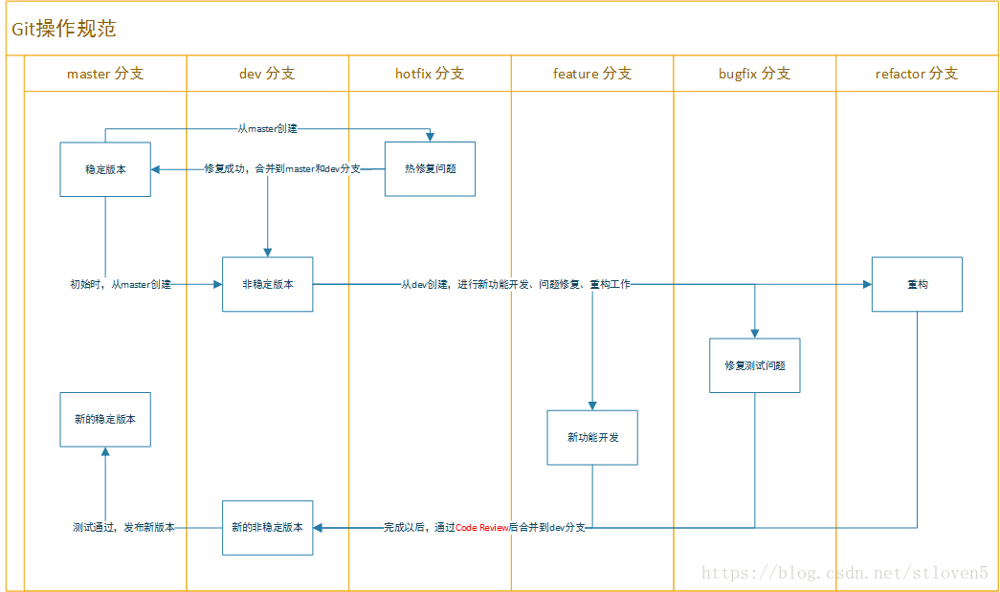

# 版本回退

**工作流中的一些细节知识：**不管是从工作区提交到暂存区，还是从暂存区提交到历史区，每一个区域当前的内容是一直保存下来的，不会消失

```shell
git log			查看所有提交信息,提交一次生成一个版本

git reflog		查询每一步回退版本的版本号，在有回退版本的时候

两个命令都市查看历史提交纪律（也相当于查看历史版本号），在没有历史版本回滚的时候，我们用哪个都可以，有历史版本回滚，git log只能查看当前回退版本以前的版本
```

==第一种==

```shell
git rm --cached . -r	从暂存区撤销 .可以替换具体文件名。不管暂存区中的内容是否已经提交打历史版本上，也不管是你第几次放到暂存区上，统统撤回，太暴力
```

==第二种(很少用)==

```shell
git checkout .		把暂存区的内容撤回工作区(上一个暂存区内容覆盖现有工作区中的内容，一旦回滚无法恢复)

git reset HEAD .	把当前暂存区的内容回滚到上一个暂存区，目的是为了把上一个暂存区内容回滚到工作区
```

```shell
场景1：工作区A,当前暂存区B,上一个暂存区C,A已经提交到B,但发现有问题于是工作区想回滚到C的内容，怎么办？

问题：git checkout .只能限制当前代码还没有提交的情况，当前代码没提交回滚的是上一次提交到暂存区的内容（和工作区内容不一样）；
如果当前这次也提交了，暂存区和工作区一样，回滚回来也是一样，这个方式就解决不了

解决方式：
1、在暂存区中，回滚到上一次暂存区中记录的内容
git rest HEAD .
2、把最新的暂存区的信息回滚到工作区，替换工作区的内容
git checkout .
```

==第三种（最常用）==


# IDE操作

## 文件颜色

- **蓝色** ：已经提交，并且已经追踪。之后有改动，改动部分没有提交。可以**直接 commit**

- **红色** ：没有提交过的文件，可以是你不想提交的文件，或者是加入了忽略文件。**得先 add 绿才能 commit**
- **黑色 **：稳定的文件，正常的不需要你关心

## 组长首次将最原始代码提交到远程仓库

```shell
#首次提交可能会碰到 403权限的问题
Windows下解决github push failed (remote: Permission to userA/XXXX.git denied to userB.) 上传gitHub失败报错
#原因是
由于该电脑使用git bash配过SSH，系统已经将指向github.com的用户设置为了userB，每次push操作的时候，都将读取到userB的用户信息，类似于记住密码。
#解决方法
https://blog.csdn.net/zz1180/article/details/89011434
```

上传代码完后，再随便修改代码再提交，**提交的时候记得设置签名**，如下设置签名说明

## 成员首次 clone 代码下来

==团队协作需要将成员加到组里面来==

不然会报错,权限问题

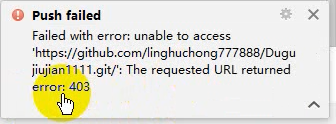

- 在项目中点击**settings页签**，然后点击**Collaborators**,然后在文本框中搜索合作伙伴的邮箱或者账号。点击添加。
- 添加后GitHub会给合作伙伴对应的邮箱发一封，邀请邮件。

- 合作伙伴会收到邀请邮件。点击View invitation 按钮后会跳转至GitHub页面，让合作伙伴选择，是否接受邀请。
- 点击接受后，则合伙伙伴正式加入项目，获得直接提交代码的权限。

## 提交代码设置签名，第一次设置就行

==先add, 再 commit==

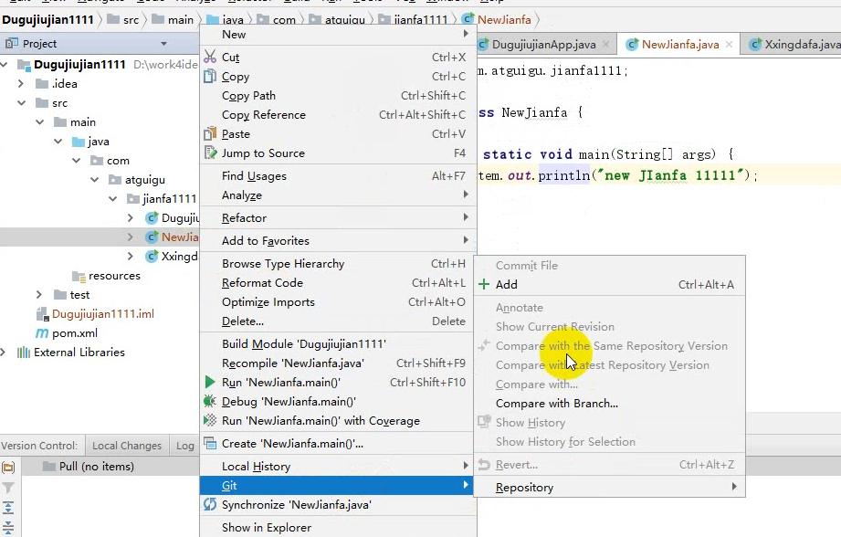

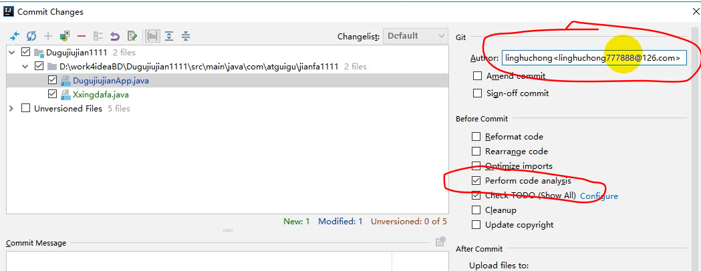

设置签名 **Author:** 姓名<邮箱>    例如：狗子<<xxxxx@163.com>>

 把 **代码检查** 和 **TODO** 去掉，省时间，没什么用，不用勾选

## 代码冲突问题

A 修改了 文件S第一行的内容，并push到远端，完后 B 也修改了同一个地方，没有pull，直接push到远端，这是后会报错：

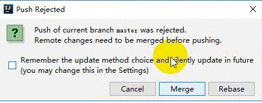

**Rebase 一般不用，主要用 Merge**

**有三种解决冲突方法**

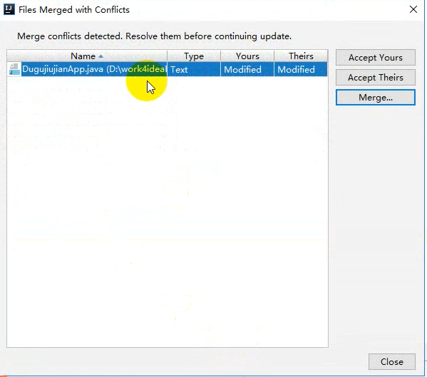

用Merge来解决如下：

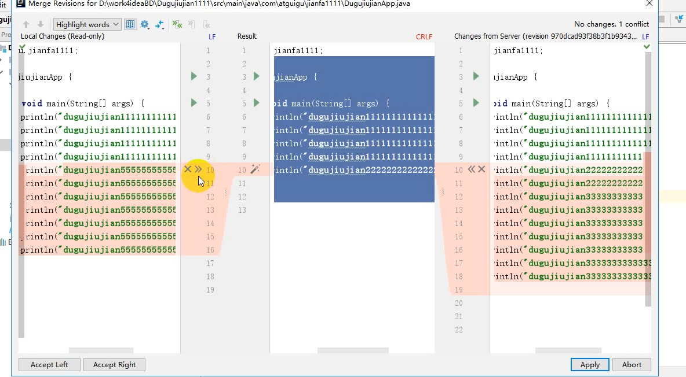

==左边表示自己，右边表示别人，中间Result代表输出结果，可以修改==

编辑合并后，再次commit File

commit File，再次push

## 开发过程分支操作

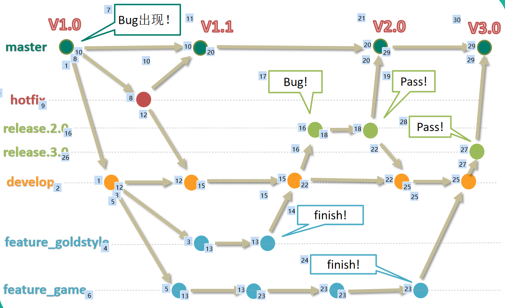

### 分支种类

- **主干分支 master**

  主要负责管理正在运行的生产环境代码。**永远保持与正在运行的生产环境完全一致。**

- **开发分支   develop**

  主要负责管理正在开发过程中的代码。**一般情况下应该是最新的代码**。

- **bug修理分支  hotfix**

  主要负责管理生产环境下出现的紧急修复的代码。 从主干分支分出，修理完毕并测试上线后，并回主干分支。并回后，视情况可以删除该分支。

- **发布版本分支  release**

  较大的版本上线前，会从开发分支中分出发布版本分支，进行最后阶段的集成测试。该版本上线后，会合并到主干分支。生产环境运行一段阶段较稳定后可以视情况删除。

- **功能分支    feature**

  为了不影响较短周期的开发工作，一般把中长期开发模块，会从开发分支中独立出来。 开发完成后会合并到开发分支。

### 分支实战

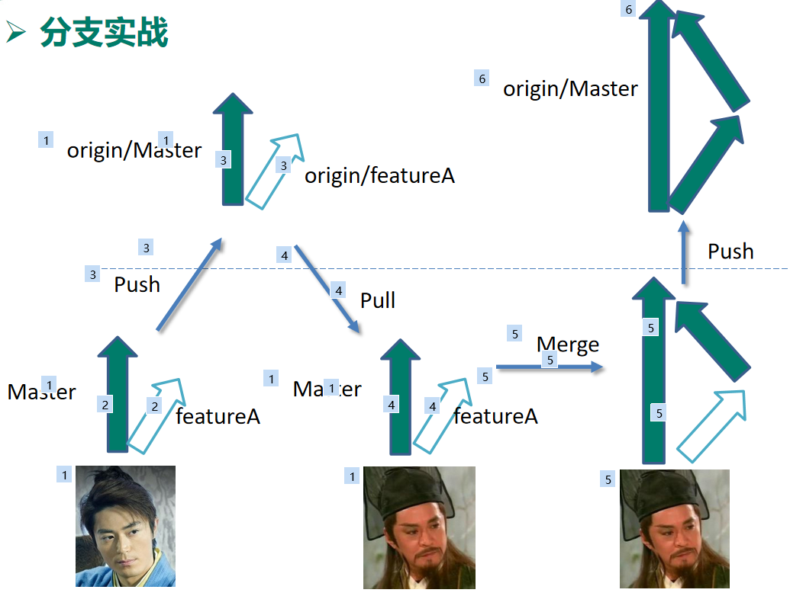


1：**组员**：在 master 或者 dev 上checkout 新分支featureA开发功能，并将分支 push 到远程，每天代码要 提交到远程分支featureA

2：**老大：**组员featureA分支完成后，将featureA 拉取下来进行合并(Merge),如下图：

**和远端分支同名建一个本地分支，并切换到这个分支，然后这个分支再 pull 下代码，这样就拉取了**

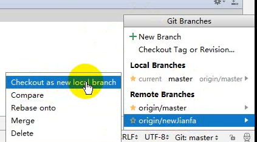

**然后拿这个分支去打包测试，通过了没问题的话，然后把这个分支合并到主干上，切到dev（或者master）, meger这个分支，最后push 到远端去，最终远端dev(或者master) 这个分支就同步了最新代码**


## GitLab和留言板

将代码 share 到github中，IDE默认会创建本地仓库，gitLab 则需要先创建本地仓库

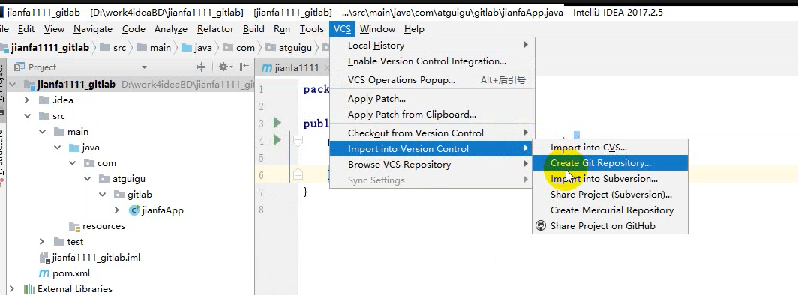

以下步骤 github 同适用

拉取代码：

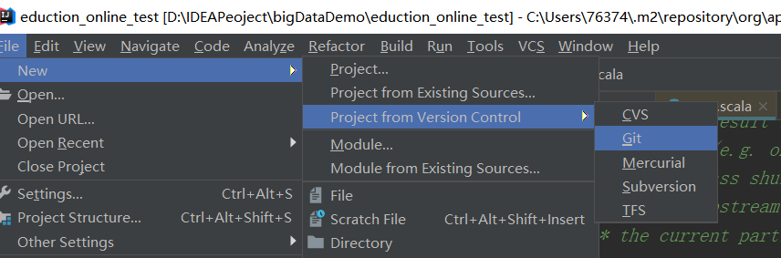

刚拉取的代码

==可能pom问及那出现这个问题，原因是没识别为 maven 项目==, 1正确，2错误

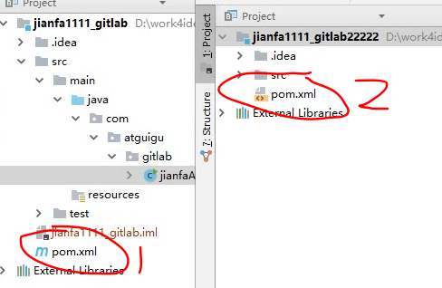

解决方法：重新导下

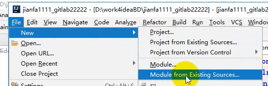

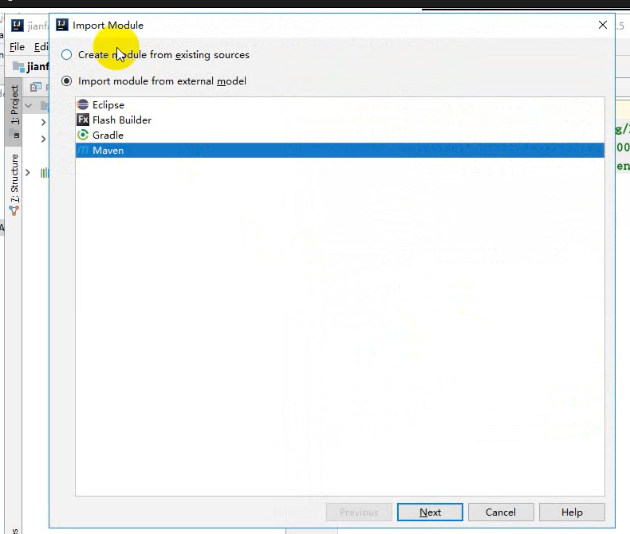

