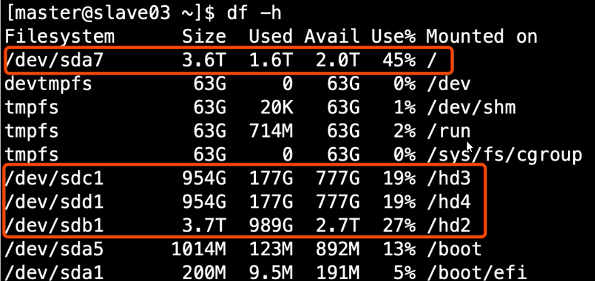

# 集群安装过程中注意事项

- 尽量使用离线方式安装

- 一定要使用非 root 用户，配置免密码的sudo权限

- 确认HDFS 的存储目录，保证存储在空间最大硬盘上

  

- 元数据备份（重点，如数据损坏，可能整个集群无法运行，至少要保证每日零点之后备份到其他服务器两个副本）
- 基准测试
- 参数调优 参考文档


# 用户行为分析（离线）

## 需求一、数据采集


**检查点** 和 **备份检查点**都会打开，如果检查点挂了，恢复数据会比较慢

```xml
hdfs-sink三个参数 （有一个生效就会直接用）
参考：https://flume.apache.org/releases/content/1.9.0/FlumeUserGuide.html#hdfs-sink
```

| 参数              | 默认配置 | 一般配置           |
| ----------------- | -------- | ------------------ |
| hdfs.rollInterval | 30       | 600 （10分钟）     |
| hdfs.rollSize     | 1024     | 1024*128 （128mb） |
| hdfs.rollCount    | 10       | 0 (切记设置成0)    |


小文件对集群的影响：

- 影响 namenode 内存
- 影响磁盘寻址
- mr 一个小文件就是 一个任务 影响性能

# 项目中碰到的问题

**1）**CDH修改配置文件不生效

**2）**公司机房，服务器没上**UPS**（给你个缓冲，保证断电后1-2小时服务器**正常运行**，如果还没有来电，能给你缓冲让你手动保证服务器进程**优雅的关闭**）, 突然有一天断电了，然后来电再重启，庆幸发现所有服务没有问题，但是在一个月后的一天，突然集群恢复到一个月之前

​	原因：元数据存在mysql,mysql配置了HA, 重启恢复连接的那台mysql 数据确实是一个月前的数据。就是因为那次断电，导致两个mysql没办法同步数据，一个主一个从，正好重启那次还是读的主，运行了两个多月，两台一直没有同步。然后再手动切到主mysql,发现启动不来了，就是这个过程发现了脏数据。然后没办法只能一条数据一条数据的去找，找了两天把问题解决了（主mysql倒退往前删一天,删前要保存，再测试启动，能启动，再去一条条比对这天的数据，否则继续删）。

所以后面改成了**冷备 （凌晨将mysq中的元数据dump到其他两个机器上）**，**这里热备指的是mysql 配置HA**, 后面上了 UPS 改成热备也没问题

**3）** flume启动问题：启动不报错，但是HDFS就是接受不到数据

​	查看 flume/conf/log4j.properti 里面设置的日志级别，然后动态调整为DEBUG 级别：


**举一反三** 查看hive, 同样找到og4j.properti 


