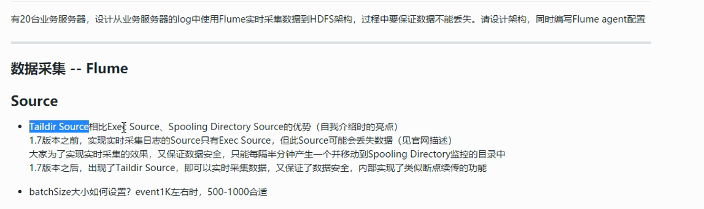
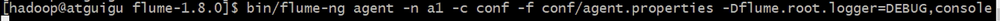

-  尽量使用离线方式安装

- 一定要使用非 root 用户，配置免密码的sudo权限

- 确认HDFS 的存储目录，保证存储在空间最大硬盘上

  

- 元数据备份（重点，如数据损坏，可能整个集群无法运行，至少要保证每日零点之后备份到其他服务器两个副本）

- 配置机架感知

  

- 基准测试

  参考CDH中的基准测试

  

- 参数调优 参考文档

  


# 用户行为分析

## 需求一、数据采集




**检查点** 和 **备份检查点**都会打开，如果检查点挂了，恢复数据会比较慢

```xml
hdfs-sink三个参数 （有一个生效就会直接用）
参考：https://flume.apache.org/releases/content/1.9.0/FlumeUserGuide.html#hdfs-sink
```

| 参数              | 默认配置 | 一般配置           |
| ----------------- | -------- | ------------------ |
| hdfs.rollInterval | 30       | 600 （10分钟）     |
| hdfs.rollSize     | 1024     | 1024*128 （128mb） |
| hdfs.rollCount    | 10       | 0 (切记设置成0)    |

小文件对集群的影响：

- 影响 namenode 内存
- 影响磁盘寻址
- mr 一个小文件就是 一个任务 影响性能


==**Flume分层**==

- **面试题**：一般生产环境分为2层

  **1、**如果只有一层，日志采集服务器非常多，此时会有很多个 Flume agent, 同时香HDFS写数据会产生多个client, 对 HDFS 压力太大了

  **2、**只有一层时，部分业务配置只能在这层配置，如后续配置修改，则要修改的位置太多，不利于后期维护

- **采集层**

  1、使用 **supervior**方式实现挂掉后自动重启 （找运维装）

  2、JVM一般设置 **512M** 即可 

  ```shell
  #（flume-env.sh java堆大小）
  export JAVA_OPTS="-Xms100m -Xmx200m -Dcom.sun.management.jmxremote"
  ```

  3、与业务服务器部署在一起

- **汇聚层**

  1、使用 load_balance

  2、JVM 一般设置为 4G

  3、部署在单独的服务器 （最低：4核8线程16GB内存）

- **jvm调优**

  1、-Xmx 与 -Xms 设置一样，减少内存抖动带来的性能影响

- **基于上面的双层架构图分析 Flume 如何保证数据至少处理一次**

  1、采集层 agent 挂掉

  2、采集层服务器挂掉

  3、汇总层 agent 部分挂掉

- **思考题**

  1、什么情况下会出现数据重复？举一个场景即可

  答：往HDFS成功写数据，此时sink应该告诉 channle写成功了，但是因为网络抖动还是断开，channle发的信号超时了，无法返回写入成功的信号。此时会把数据弄到 channle再写一次（事务）

  所以 flume 只能达到**至少处理一次**，无法达到精确处理一次

  所以 flume 不会丢数据，除非你的配置有问题

  2、现在汇聚层向 HDFS 写数据事， channel中积压了大量的数据，有哪些解决方案？

  答：1、sink批处理，但是有上限

  ​		2、开多个 sink

  

## 需求二、数据清洗、加载

问题：是用spark 清洗数据到 HDFS 中再加载到 hive表，还是spark清洗完直接加载到hive中

答：前者，数据量大如果清洗完准备 加载到hive表中程序突然挂掉了，那清洗工作就白跑了

**部署**

- **面试题：yarn cluster 和 yarn client区别**

  client 瓶颈在网卡流量上，所以单台 client 负载高，网络IO

- **executor memory 和 executor cores 如何设置**（参考用户行为分析8.5）

  **20台：**单台128G内存 + 40线程CPU	

  **给到yarn的资源单台：**36线程	108G

  **yarn总资源池：** 2160G内存 720线程CPU

  **yarn根据业务部门来划分队列：**

  

- **扩展提：Yarn资源调度器种类，CDH 和 HDP 版本默认不同调度器原因**

-   **hive表中 level 和 is_vip 使用 TINYINT,而不是使用INT？**

  答: 减少内存

- **分区字段 dt 为什么要存储 int 型，如20190408，而不是字符串的 ‘2019-04-08’**

  答：Where 查询 肯定 int 比字符串速度快

  

## 指标实现

//TODO


## Sqoop导出深入

sqoop 只有map阶段（默认4个map）, reduce设置为0

**问题1：**java 业务数据库 schme字段老变化，用sqoop从mysql 导入到 hive就老出问题，有个小伙伴想出一个办法，java变字段不会改代码，改完需要提交到 github上，这个时候就去监控 github的文件，看那些文件改动了什么字段，再去修改 hive 表结构，后来发现改完代码只是提交到了github，并没有同步到线上环境，msyql数据库字段还是么有变

解决方式：

```shell
#这里是根据字段动态生成表，防止建好表，schme字段老变化
sqoop import \
--connect jdbc:mysql://atguigu:3306/app \
--username root \
--password 123456 \
--table users \
--fields-terminated-by "\t" \
--delete-target-dir \
--target-dir /user/hive/warehouse/ods.db/users
--num-mappers 4 \
--hive-import \
--hive-database ods \
--hive-table users \
--null-string '\\N' \
--null-non-string '\\N'
```


##Kafka配置


==上面log 改成 lag==

## 实时处理

- DB.localTx 实现 spark 写入 mysql的事务

- 思考？redis 事务怎么实现

- Structured Streaming 用来替代 sparkStreaming, 2.20以后才能用

- 用稳定版的 **[ spark-streaming-kafka-0-8](http://spark.apache.org/docs/2.1.0/streaming-kafka-0-8-integration.html)**

  http://spark.apache.org/docs/2.1.0/streaming-kafka-integration.html

  

==sparkStreaming面试题==

-  **Direct** 方式 对比 **receiver **方式的优势

  见官网http://spark.apache.org/docs/2.1.0/streaming-kafka-0-8-integration.html

  1、简化并行性， Kafka 和 RDD 分区一一对应

  2、效率：为了实现零数据丢失，第一种将数据存储再预写日志中，低效。第二种没有预写日志，直接从kafka 中恢复

  3、一次语义

- **如何精确一次语义消费 **

  (见官网说明)默认情况下，输出操作确保*至少一次*语义，因为它取决于输出操作的类型（是否为幂等）和下游系统的语义（是否支持事务）。但是用户可以实现**自己的事务处理机制**来实现*一次*语义。

  即 **output** 和 **保存偏移量** 在同一个事务中，保证原子性

  


- **为什么一定要设置checkpoint**
- **checkpoint保存了哪些数据**

https://spark.apache.org/docs/2.1.0/streaming-programming-guide.html#checkpointing


- **为什么没有把offset保存在ZK中**

  1、kafka 0.9之前是保存在zk中，之后是保存在本地，是因为kafka团队发现保存在zk中出现了瓶颈，如果topic数量特别多的情况下，拿来存offset频繁读写，就会出现瓶颈，

  2、**没法保证事务**，就没法实现精确消费一次，无论保存在 mysql 还是 redis 中都没法保证事务，两个技术框架 

  

- **设置 checkpoint 会有哪些问题？**

  **对吞吐量有影响**，所以。通常，DStream的5-10个滑动间隔的检查点间隔是一个很好的尝试设置。

  

- （流浪峰值）遇到流量激增时如何处理？比如之前每个batch1W条，活动时突然变成每个batch100W条。我们要怎么做？

  ```scala
  #之前开启这个
  spark.streaming.kafka.maxRatePerPartition此直接API读取每个Kafka分区的最大速率（以消息每秒为单位）。只能通过压测来测出最大值
  ```

  压测要根据spark的UI来观察

  

  如上图，输入的数据太多，处理太慢，就会积压，通过 **Scheduling Delay** 看出来有延迟，代表此时计算能力不足，逐渐的增加**maxRatePerPartition**的值，根据 **Scheduling Delay**来看是否有延迟

  **但是这样确定一个固定的值会有弊端：**假设空闲时测得是 4000，但因为其他人也用了计算资源，用了网络IO，那我实际就达不到4000，所以这是动态变化得，受集群性能，网络IO等影响

  ==解决==

  ```scala
  #动态计算批次的数量，去kafka里面拿
  基于Direct方式下设置spark.streaming.backpressure.enabled=true即可
  ```

  ==//TODO 补充反压机制==

  https://www.jianshu.com/p/28fcd51d4edd
  

## foreachRDD、foreachPartition和foreach

官网算子介绍：http://spark.apache.org/docs/2.3.0/rdd-programming-guide.html

三者区别：https://blog.csdn.net/Scapel/article/details/84030362

```properties
foreachRDD: DStream中每一个时间间隔的RDD （函数在driver上执行）
foreachPartition: 每一个时间间隔的RDD中的每一个partiton （函数在 excutor 上执行）
foreach: 每一个时间间隔的RDD中的每一个元素 （函数在 excutor 上执行）
```

```properties
foreach和foreachPartition介绍：https://blog.csdn.net/weixin_43866709/article/details/88667288
1: foreach 是一条一条的拿数据进行处理,foreachPartition是一个分区一个分区的拿数据，一个分区中有很多数据的信息。所以，在使用中，当我们要把处理结果保存到数据库中的时候，我们要使用foreachPartition这个方法，这样效率会更高。
2: 通过上面的例子也说明了，foreach和foreachPartition这两个方法执行完之后不会将结果收集到driver端。而collect，top，count这些方法是会把结果收集到driver端的
```

```properties
foreachRDD 正确使用规范
误区一：在driver上创建连接对象（比如网络连接或数据库连接）
	如果在driver上创建连接对象，然后在RDD的算子函数内使用连接对象，那么就意味着需要将连接对象序列化后从driver	传递到worker上。而连接对象（比如Connection对象）通常来说是不支持序列化的，此时通常会报序列化的异常			（serialization errors）。因此连接对象必须在worker上创建，不要在driver上创建。
	
误区二：为每一条记录都创建一个连接对象
  通常来说，连接对象的创建和销毁都是很消耗时间的。因此频繁地创建和销毁连接对象，可能会导致降低spark作业的整体性能和吞吐量。
```

##updateStateByKey的问题、mapWithState

==updateStateByKey的问题：==

1、见代码streaming/VipIncrementAnalysis.scala 按地区分组统计每日新增VIP数量


每个批次都会把以前计算过的省份给计算一次，很可能某批次没有北京，也记录了一次，这样就增加了鞋面写入MySQL的负担

2、因为是实时任务，不断跑，2019-04-03还是会有 2号的数据，在历史状态中保存了，这样就会有问题，spark1.6已经意识到这个问题


这两个痛点 ==mapWithState==可以解决，==但是不用==

1、只有北京的就处理北京，不会把陕西的处理进去

2、可以设置超时时间，3号就不会再计算2号的数据


源码解读：https://www.cnblogs.com/DT-Spark/articles/5616560.html

但是他还是实验的，2.4.0还是实验的，==在企业中不用==，但是没办法，目前只能用**updateStateByKey**，

所以spark 出了 ==Structured Streaming==来替换 spark-Streaming,非常简单就能**实现状态管理** 和 **精确消费**


也可以将**状态保存 redis 中**，redis可以设置key的失效时间，


## 精确消费一次实操

用foreachPartition是没法实现精确一次消费，因为在 foreachPartition 中开启事务，然后更新偏移量的时候就会有问题，经过了 **shuffle 算子**比如图中的 updateStateByKey,**分区数可能会发生变化**，而且**分区中的数据也可能会变化**， **处理完一个分区更新偏移量缺更新了所有分区的偏移量**，这是有问题的。即使没有经过 shuffle算子，**分区数没变但是分区里面的数据可能会发生变化**，也会有问题，代码如下


==如何解决？==

==首先要强调的是使用的是 Direct 模式，然后确定算子是否用了 shuffle, 用了shuffle就要将数据返回到drive端来开启事务，如果是 map-only的算子，那可以在foreachPritition来开启事务==

Direct模式优点：

​	1、提高并行度，分区是一一对应的   2、高效  3、可以实现精确一次消费

1：不用foreachPartition，直接用 foreachRDD，这样更新偏移量就不会出现处理完一个分区缺更新了所有分区偏移量的问题

2：将结果返回给 driver，在driver端开启事务，driver端处理完逻辑就更新偏移量，excutor不用处理业务逻辑和更新偏移量，这样就不会出**序列化问题**。

3：为了避免数据量过大，在 foreachRDD 前面加个过滤器，只保留最近2天的数据，这样返回给Driver的数据会非常小，只保留最近2天的状态,因为怕系统时间或数据采集过程中有稍许延迟，所以没有设计保留1天，**怕数据卡在边界上丢失了**

4：**对窗口操作支持不好**，见下图，加入窗口是3，滑动为2，第一行代表该批次的会员数，例子是统计窗口会员数大于3。第二行是时间批次，可看到假如执行完第一个窗口(黄块1，时间1-3)，下个窗口应该是处理（黄块2时间3-5），假如此时程序挂了，偏移量记录到了时间批次3这个位置，那下次重启程序就是从 3这个位置开始执行。但是**能保证在一个窗口内不出错**。


```scala
// 业务计算
    messages.transform{rdd =>
      offsetRanges = rdd.asInstanceOf[HasOffsetRanges].offsetRanges
      rdd
    }.filter{ msg =>
      // 过滤非完成订单的数据，且验证数据合法性
      filterCompleteOrderData(msg)
    }.map{ msg =>
      // 数据转换，返回((2019-04-03,北京),1)格式的数据
      getCountryAndDate(msg)
    }.updateStateByKey[Int]{
      // 更新状态变量
      updateFunc
    }.filter{ state =>
      // 只保留最近2天的数据，这样返回给Driver的数据会非常小
      filter2DaysBeforeState(state)
    }.foreachRDD(rdd=> {

      // 将最近两天的数据返回给Driver端
      val resultTuple: Array[((String, String), Int)] = rdd.collect()

        // 开启事务
        DB.localTx { implicit session =>
          resultTuple.foreach(msg => {
            val dt = msg._1._1
            val province = msg._1._2
            val cnt = msg._2.toLong

            // 统计结果持久化到Mysql中
            sql"""replace into vip_increment_analysis(province,cnt,dt) values (${province},${cnt},${dt})""".executeUpdate().apply()
            println(msg)
          })

          for (o <- offsetRanges) {
            println(o.topic,o.partition,o.fromOffset,o.untilOffset)
            // 保存offset
            sql"""update topic_offset set offset = ${o.untilOffset} where topic = ${o.topic} and part_id = ${o.partition}""".update.apply()
          }
        }
      println("==========================")
    })
```


# SQl问题

```shell
两表直接笛卡尔积的结果数量是两表的数据量相乘

带where条件id相等的笛卡尔积和inner join结果相同，但是inner join效率快一点

left join：TEST_A表的ID为空时拼接TEST_B表的内容为空，right join则相反

full join：等于left join和right join的并集

#例子
不带条件的笛卡尔积：select * from TEST_A a,TEST_B b;
带where条件id相等的笛卡尔积：select * from TEST_A a,TEST_B b where a.ID = b.ID;
```


这里指 hiveSql 和 sparkSql

- 1、hive1.2.1是不支持不等值连接的，2版本后是支持的。而 sparkSql支持

  ```sql
  t2.event_time - t1.event_time <= 900
  ```

- **left join**  和 **left semi join**（左半开连接）

  ```sql
  select count(distinct t1.uid)from
  select uid from student where event_key = "startVideo" t1
  left semi join
  select uid from student where event_key = "finishHomeWork t2
  on t1.uid = t2.uid
  ```

  **left semo join** 性能高如图：1 join到 1之后就不会往下join

  

  ==有个弊端==：最外层的 select 查询只能取到左表的列，因为右边的表只有 t2.uid参加了运算，

  而又设置了等号 t1.uid=t2.uid，所以右边的表跟左边的表字段一样


# 项目中碰到的问题

**1）CDH修改配置文件不生效**

**2）**公司机房，服务器没上**UPS**（给你个缓冲，保证断电后1-2小时服务器**正常运行**，如果还没有来电，能给你缓冲让你手动保证服务器进程**优雅的关闭**）, 突然有一天断电了，然后来电再重启，庆幸发现所有服务没有问题，但是在一个月后的一天，突然集群恢复到一个月之前

​	原因：元数据存在mysql,mysql配置了HA, 重启恢复连接的那台mysql 数据确实是一个月前的数据。就是因为那次断电，导致两个mysql没办法同步数据，一个主一个从，正好重启那次还是读的主，运行了两个多月，两台一直没有同步。然后再手动切到主mysql,发现启动不来了，就是这个过程发现了脏数据。然后没办法只能一条数据一条数据的去找，找了两天把问题解决了（主mysql倒退往前删一天,删前要保存，再测试启动，能启动，再去一条条比对这天的数据，否则继续删）。

所以后面改成了**冷备 （凌晨将mysq中的元数据dump到其他两个机器上）**，**这里热备指的是mysql 配置HA**, 后面上了 UPS 改成热备也没问题

**3） flume启动问题：启动不报错**，但是HDFS就是接受不到数据

​	查看 flume/conf/log4j.properti 里面设置的日志级别，然后动态调整为DEBUG 级别：



**举一反三** 查看hive, 同样找到og4j.properti 


**4） 你们会用 Flume 做 ETL工作吗？**

​	拉钩就是这做的，会发现性能上不来，吞吐量根本上不来

​	1、flume本身就不适合做数据清洗，如果如按不同key发到不同地方还行，但如果要去改key的话就不适合

​	2、flume 过滤掉了后期怎么做 数据质量监控，后面拿到的数据全是正确的，过滤掉的数据不一定是有问题的数据，可能是因为前端程序员的bug导致。


**5）sparkStreaming 程序正在跑，但是因为某些业务原因需要修改代码，加减一些 算子等，这时该怎么办？**

此时如果停止去修改代码，再重启跑的话会报错，因为 **checkpoint** 因为修改代码就会错乱了

**解决：**

**1、最严谨的做法**：把重新写的代码打包一个新任务去跑，kafka从头消费，auto.offset.reset-> smallest

一点点追，直到消费到和老代码一样的位置，就停止老代码

但这样恢复 7天的数据成本比较大，kafka保存7天数据

**2、但企业不这么做** ：一般企业大屏展示是当天的数据，对于这种按天计算的业务逻辑，直接修改老代码，然后等半夜 11：30之后上线，取巧，因为11：30没什么人看了。马上就到第二天了


**6）** 

hue提供给BI查询，hue用sparkSql, 开启 start-thriftserver.sh服务 用来jdbc连接，每隔两三天 thriftserver服务就 oom ，即使设成了 32个G ,还是会 oom

# 平台运行一段时间后可能遇到的问题（优化）

参考xmind

##**1、随时数据量越来越大，查询速度变慢，特别是BI反馈，经常要查询半年或更久的数据（自我介绍时的亮点）**

**1、横向扩展**

​	集群内新增服务器，记住一定要reblance（面试题）

​	CDH集成平台如何实现数据重分布:

​	https://www.aboutyun.com/forum.php?mod=viewthread&tid=19194

**2、纵向扩展**，

​	加入SSD，并实现数据分层存储:https://hadoop.apache.org/docs/r2.7.0/hadoop-project-dist/hadoop-hdfs/ArchivalStorage.html

举个例子，查找表的时候，能经常看见下面这个 input 数据量,如果 CPU,内存没问题，这个特别大就要注意了，可能会出现IO瓶颈

```shell
scala> sc.textFile("/tmp/test.log").count
res8: Long = 1029
```


热点数据放在ssd,普通数据放机械硬盘

比如把**近半年的用户行为数据**存在 ssd

把**数仓的所有数据**存 ssd

其他的行为数据（半年之前的）放机械，查的概率比较小


==数据分层 //TODO带补充==

```shell
#配置 dataNode 多目录
参数： dfs.datanode.data.dir      值(file可以不写)：file://${hadoop.tmp.dir}/dfs/data
```


比如有四块硬盘，sda7和 sdb1是机械 , sdc1和 sdd1是ssd, 那么参数的配置就是如下：

```shell
#尖括号里面指定类型，不写默认是[DISK]，代表机械
[SSD]/hd3/hdfs/data,[SSD]/hd4/hdfs/data,[DISK]/hd2/hdfs/data
#在规划集群的时候注意尽量每台机器硬盘规划一样，假如有一台是 /hadoop/hdfs/data,那参数配置配置就要所有的都写进去，机器会扫描所有的并去里面找自己存在的目录
[SSD]/hd3/hdfs/data,[SSD]/hd4/hdfs/data,[DISK]/hd2/hdfs/data,[DISK]/hadoop/hdfs/data
```

设置好了硬盘后该往里面放入数据，这里分两种情况,假如是放ssd

1、有老数据需要迁移到ssd，两步，先建再移动数据

```shell
#1、hdfs storagepolicies -setStoragePolicy -path <path> -policy <policy>
-path <路径>	指向目录或文件的路径。
-policy <策略>	存储策略的名称。
策略看文档 https://hadoop.apache.org/docs/stable/hadoop-project-dist/hadoop-hdfs/ArchivalStorage.html

hdfs storagepolicies -setStoragePolicy -path /user/hive/xxxx/20190412 -policy ALL_SSD

#2、hdfs mover [-p <files/dirs> | -f <local file name>]
-p <文件/目录>	指定以空格分隔的要迁移的HDFS文件/目录列表。
-f <本地文件>	指定一个本地文件，其中包含要迁移的HDFS文件/目录的列表。

hdfs mover -P /user/hive/xxxxx/.../20190201

```

2、新数据直接写入到 ssd

```shell
hdfs storagepolicies -setStoragePolicy -path /user/hive/xxxx/20190412 -policy ALL_SSD
```

==LIST SET UNSET GET各种策略看文档==


## 2、重大事故举例：BI因SQL语句查询全量埋点，大概20T，并几张表join时，有一个没有写连接条件生成迪卡尔积，集群带宽瞬间被占满，磁盘IO激增，平台无响应

解决方案：为HDFS的/user/hive/warehouse/tmp.db设置quotas （配额）

https://hadoop.apache.org/docs/r2.7.7/hadoop-project-dist/hadoop-hdfs/HdfsQuotaAdminGuide.html

可以设置**目录的文件最大数** 或 **目录下总文件的大小**


# 企业工作流程


# 企业级认证、授权

**认证：**判断访问者是否是这个人，**Kerberos** 比较重量级，配置和用起来很繁琐

用的多的是 **LDAP(轻量木目录访问协议)**，hive,sparkSql, hue都支持

**授权**：授权某些用户组对某些目录，表，列，字段等的权限。cdh用**sentry**,

hdp用**ranger**